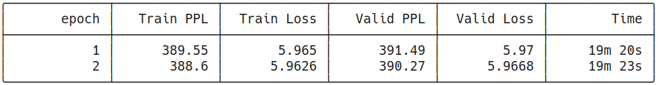

# E2A14P1

**Note: only code changes/major additional codes are shown. For complete code, please see the accompanying notebooks**

## Objectives
The objectives of this assignment was to train the BERT Model for Question Answering on the Stanford Question Answering Dataset (SQuAD). 


## The BERT Model
BERT is a transformer-based model which is bi-directional in nature. This means that it can learn information from either sides of an input (unlike the vanilla Transformers which can only learn from previous inputs). This is useful because in real-life, words in our sentence are affected by future words not yet spoken/written down the sentence.  

The pre-training and fine-tuning method is shown below.


A number of pre-trained models are avaialble for download. These can have a different 'head' (or top-layers) that can be used for different purposes e.g.

- Sequence Classification
- Question-Answering
- Comprehension
etc.


### Link to Notebook

[](https://colab.research.google.com/github/payne101/E_14_1/blob/main/E_14_1.ipynb)


## Notebook Features
- The training is done using PyTorch Lightning

## Obtaining Data
The data is downloaded using the `datasets` library from HuggingFace.

```python
datasets = load_dataset("squad_v2")
```

## Filtering and Reducing Data
Unfortunately, there are many samples in the dataset that do not have answers (unlabelled data). We remove them (by checking the text of the answers key) before proceeding

```python
train_dataset_filtered = datasets['train'].filter(lambda x: x['answers']['text'] != [])
```

The filtered dataset has around 86821(5928) train(test) samples, and a single epoch takes around 3 hours!

We reduce the train/test data further to 8000/2000 samples .

```python
train_size = 8000
train_dataset_red, _ = torch.utils.data.random_split(train_dataset_filtered, [train_size, len(train_dataset_filtered) - train_size])
```
## The Dataset Class
We build a dataset class inside which we process (including tokenization) the data. 

We also calculate the start and end position for the model to calculate the loss.

```python
start_positions = data_row['answers']['answer_start'][0]
end_positions = data_row['answers']['answer_start'][0] + len(data_row['answers']['text'][0])
```
We then proceed to create the dataloaders

## Model

We use the `AutoModelForQuestionAnswering` model from the transformers library and pass in the necessary parameters.

```python
automodel = AutoModelForQuestionAnswering.from_pretrained(model_checkpoint)
```
## Calculating Loss
If the start_/end_positions are provided to the model, it automatically computes the loss values and we don't have to specify/calculate the loss function etc.


## Training Log

